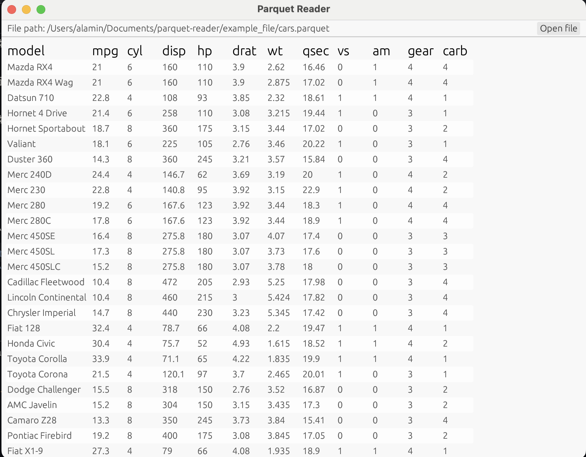

### Parquet Reader

This is a small parquet viewer GUI that reads a parquet file and displays the data in a table. It is written in Rust.

The GUI is built using "egui" library. The parquet file is read using the "parquet" library.

I've built this over a weekend to learn Rust and to get familiar with the "egui" library.

### Limitations

Currently, it doesn't have any error handling. Very limited support for different data types. It only supports reading parquet files with the following data types:
```
String(String),
Int(i32),
Float(f64),
Bool(bool)
```
Might add more support for other data types in the future.

### Usage

To run the program, you need to have Rust installed. You can install Rust by following the instructions on the [Rust website](https://www.rust-lang.org/tools/install).

To run the program, you can use the following command:

```bash
cargo run
```

Once you run the project you will be able to select a parquet file and view the data in the file.


